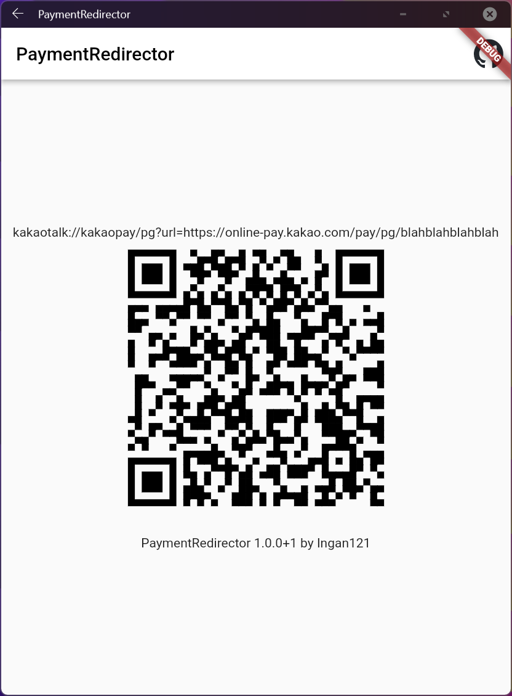

# PaymentRedirector

* 공기계에서 토스/카카오페이 결제할 수 있게 해주는 앱

* 앱 설치 후 공기계에서 토스/카카오페이 결제버튼 누르면 뜨는 QR코드를 메인폰에서 스캔하여 결제 진행



## English

* An app that intercepts certain URL schemes and shows the URL as a QR code
* Designed for some payment services only working with telephony-enabled devices
* Scan the QR code on your main phone and continue the payment there
* You have to add the app's URL scheme to ```android/app/src/main/AndroidManifest.xml``` or ```ios/Runner/info.plist```
* On Android, you will also have to change the package name to that of the payment app in ```android/app/build.gradle```